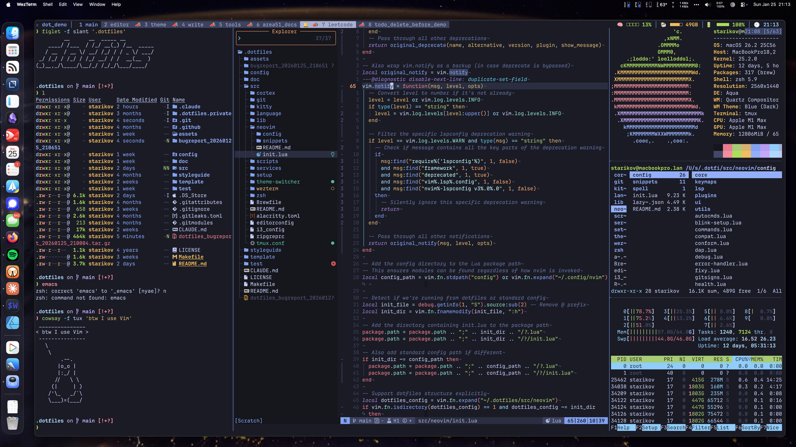

# dotfiles

> A modern, fast, and meticulously crafted development environment for macOS and Linux.

[](https://github.com/IllyaStarikov/dotfiles/actions)
[](https://github.com/IllyaStarikov/dotfiles/actions)
[](LICENSE)



## Quick Install

```bash
git clone https://github.com/IllyaStarikov/dotfiles.git ~/.dotfiles
cd ~/.dotfiles
./src/setup/setup.sh
```

That's it. The installer handles everything else.

## What You Get

A complete development environment with:

- **Neovim** - Modern IDE with 80+ plugins, LSP for 20+ languages
- **Zsh** - Fast shell with smart completions and productivity features
- **tmux** - Terminal multiplexer with intuitive keybindings
- **Git** - Enhanced workflows with better diffs and aliases
- **Theme Switcher** - Automatic light/dark mode across all tools

Everything works together. Change your system theme, and your entire terminal environment adapts instantly.

## Key Features

### 🚀 Performance First
- Neovim starts in under 200ms
- Lazy-loaded plugins and optimized configs
- Parallel processing wherever possible

### 🎨 Beautiful Defaults
- TokyoNight themes (4 variants)
- Consistent styling across all applications
- Automatic theme switching with macOS appearance

### 🛡️ Production Ready
- Comprehensive test suite (unit, functional, integration)
- CI/CD pipeline with multi-OS support
- Security scanning and code quality checks

### 🔧 Developer Focused
- LSP support for 20+ languages out of the box
- AI integration (Copilot, local LLMs via Ollama)
- Smart formatting with language detection

## Documentation

Detailed documentation lives in each component's directory:

- [Neovim Configuration](src/neovim/README.md)
- [Shell Environment](src/zsh/README.md)
- [Theme System](src/theme-switcher/README.md)
- [Scripts & Tools](src/scripts/README.md)
- [Setup & Installation](src/setup/README.md)

## Tools & Languages

### Included Tools
`neovim` `zsh` `tmux` `git` `fzf` `ripgrep` `fd` `bat` `eza` `starship` `lazygit`

### Supported Languages
`python` `javascript` `typescript` `go` `rust` `c/c++` `lua` `bash/zsh` `ruby` `java` `swift` `kotlin` `dart` `elixir` `haskell` `ocaml` `latex` `markdown` `yaml` `json`

### Formatters & Linters
`ruff` `yapf` `prettier` `stylua` `clang-format` `shfmt` `gofmt` `rustfmt` `rubocop`

## Commands

```bash
# Daily Use
theme           # Switch theme based on system appearance
update          # Update all packages, plugins, and tools
fixy <file>     # Auto-format any file

# Development
nvim            # Launch Neovim
tmux new -s dev # Start tmux session
lazygit         # Git UI

# Testing
./test/runner.zsh --quick     # Run quick tests (< 10s)
./test/runner.zsh --full      # Run complete test suite
```

## System Requirements

### macOS
- macOS 12+ (Monterey or later)
- Xcode Command Line Tools
- Homebrew

### Linux
- Ubuntu 20.04+, Debian 11+, Fedora 35+, or Arch
- Git 2.25+
- Curl or wget

## Project Structure

```
~/.dotfiles/
├── src/          # Source configurations
├── test/         # Test infrastructure
├── config/       # Tool configurations
└── .github/      # CI/CD workflows
```

## Contributing

Contributions are welcome! This project follows:
- Comprehensive test coverage
- Code formatting standards (via `fixy`)
- Security scanning on all commits

## Acknowledgments

Built with inspiration from the community and powered by outstanding open-source tools. Special thanks to the Neovim, tmux, and Zsh communities.

## License

MIT - See [LICENSE](LICENSE) for details.

---

<div align="center">
  <sub>Crafted with precision for developers who care about their tools.</sub>
</div>