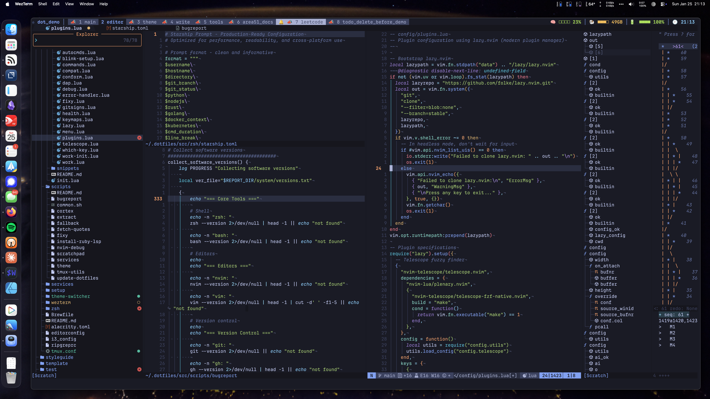
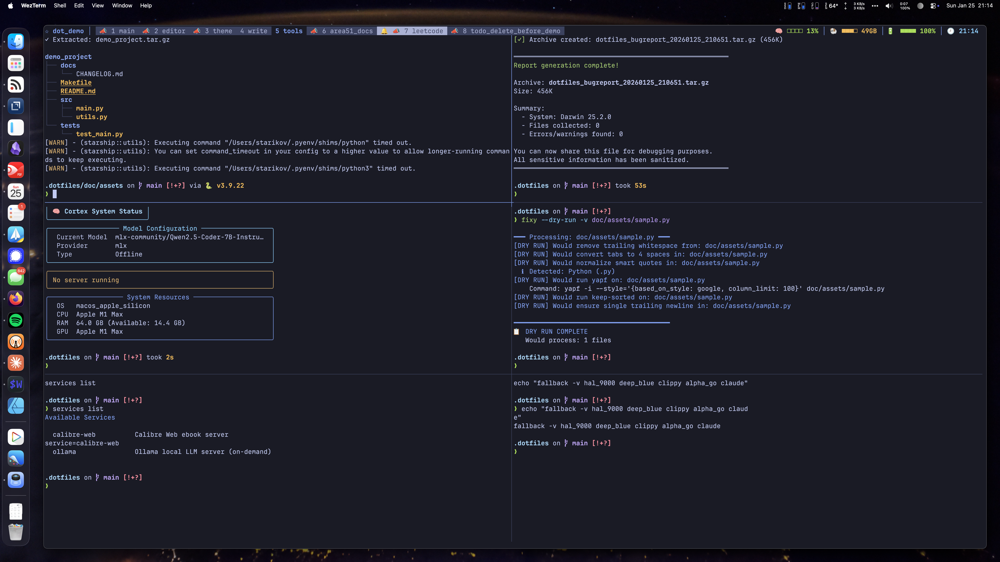
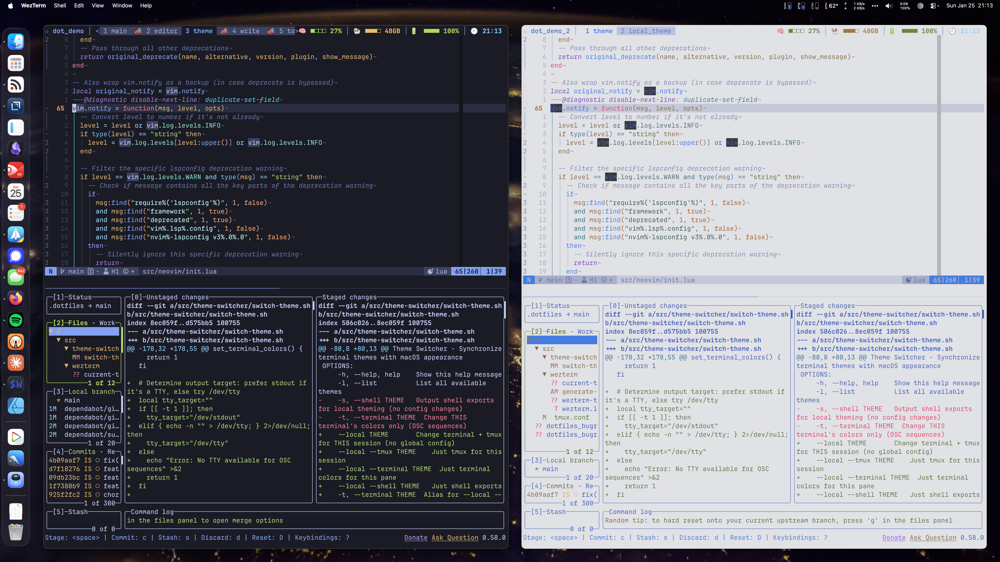
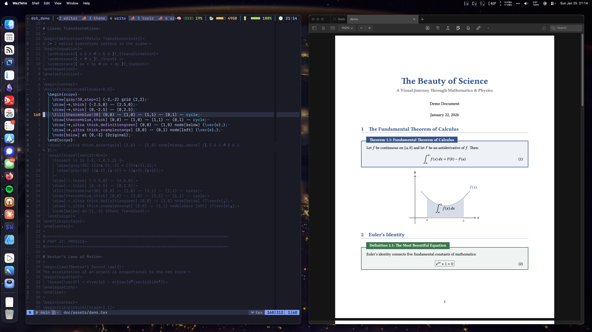

# dotfiles

> Power of an IDE, speed of a text editor.


## Why This?

- Themes sync across terminal, editor, tmux, and prompt in one command
- 40+ automated tests prevent configuration drift
- Private repo support for private configs
- One-liner install, clean uninstall
- 20+ languages with LSP, linting, and formatting out of the box

|                                                  |                                                   |
| :----------------------------------------------: | :-----------------------------------------------: |
|                    |                       |
| **Editor** as capable as an IDE, as fast as vim  |   **Tools** that make the daily grind disappear   |
|                      |                       |
| **Theme** switching that keeps every app in sync | **Write** Markdown and LaTeX without the friction |

## Requirements

| Platform | Version                        |
| -------- | ------------------------------ |
| macOS    | 12.0+ (Intel or Apple Silicon) |
| Ubuntu   | 20.04+                         |
| Debian   | 11+                            |
| Fedora   | 35+                            |
| Arch     | Rolling                        |

**Prerequisites:**

- `git` 2.30+
- `curl` or `wget`
- `zsh` shell (macOS default, install on Linux)
- ~5GB disk space (full install)
- Internet connection

## Install

### Quick Start

```bash
git clone https://github.com/IllyaStarikov/dotfiles.git ~/.dotfiles && ~/.dotfiles/src/setup/install.sh
```

| Mode     | Command                           | Time      | Description          |
| -------- | --------------------------------- | --------- | -------------------- |
| Full     | `./src/setup/install.sh`            | 15-30 min | Complete environment |
| Core     | `./src/setup/install.sh --core`     | 5-10 min  | Essential tools only |
| Symlinks | `./src/setup/install.sh --symlinks` | 30 sec    | Link configs only    |

**Options:** `--skip-brew` (corporate machines) · `--verbose` · `--help`

## Try This First

```bash
theme moon              # Dark mode, everywhere, instantly
fixy messy_code.py      # Auto-format any file
nvim +Telescope\ files  # Fuzzy find everything
```

## Features

| Tool       | What You Get                                                         |
| ---------- | -------------------------------------------------------------------- |
| **Neovim** | 80+ plugins, 150ms startup, LSP for 20+ languages, AI built-in       |
| **Zsh**    | Starship prompt, syntax highlighting, completions that actually work |
| **tmux**   | Intuitive bindings, session persistence, theme-aware                 |
| **Theme**  | 4 TokyoNight variants, one command syncs everything                  |
| **Search** | fzf + ripgrep = find anything, fast                                  |

**Languages:** Python · JavaScript · TypeScript · Go · Rust · C/C++ · Lua · Swift · Kotlin · LaTeX

## Keybindings

| Key           | Action          |
| ------------- | --------------- |
| `<Space>ff`   | Find files      |
| `<Space>fg`   | Live grep       |
| `<Space>e`    | File explorer   |
| `<Space>ac`   | AI chat         |
| `<C-h/j/k/l>` | Navigate splits |
| `gcc`         | Toggle comment  |

Full reference: [keymaps](src/neovim/config/keymaps/KEYMAPS.md)

## Performance

| Component       | Measured | Notes               |
| --------------- | -------- | ------------------- |
| Neovim startup  | 150ms    | M1 Mac, 80+ plugins |
| Zsh startup     | 50-150ms | Zinit turbo mode    |
| tmux startup    | ~125ms   | New session         |
| Theme switching | <500ms   | All apps synced     |
| Memory usage    | <200MB   | Under normal load   |

## Documentation

### Core Components

| Component                              | Description                      |
| -------------------------------------- | -------------------------------- |
| [Neovim](src/neovim/README.md)         | 80+ plugins, LSP, AI integration |
| [Zsh](src/zsh/README.md)               | Zinit, completions, prompt       |
| [Git](src/git/README.md)               | SSH signing, delta, hooks        |
| [Scripts](src/scripts/README.md)       | fixy, theme, update, utilities   |
| [Setup](src/setup/README.md)           | Installation, platform detection |
| [Themes](src/theme/README.md) | TokyoNight, app sync             |

### Guides

| Guide                                  | Description            |
| -------------------------------------- | ---------------------- |
| [Quick Start](doc/setup/README.md)     | Get up and running     |
| [Customization](doc/guides/README.md)  | Make it yours          |
| [Usage Reference](doc/usage/README.md) | Commands & keybindings |

### Development

| Resource                                 | Description         |
| ---------------------------------------- | ------------------- |
| [Language Tools](src/language/README.md) | Formatters, linters |
| [Testing](test/README.md)                | Test infrastructure |
| [CI/CD](.github/workflows/README.md)     | GitHub Actions      |

## Uninstall / Reset

```bash
./src/setup/uninstall.sh             # Remove symlinks only
./src/setup/uninstall.sh --restore   # Remove symlinks + restore backups
./src/setup/uninstall.sh --full      # Complete removal
./src/setup/uninstall.sh --dry-run   # Preview changes
```

Backups are at `~/.dotfiles.backups/`

## Contributing

Bug fixes and improvements welcome. These are personal dotfiles, so features may be declined if they don't fit my workflow.

## License

MIT - See [LICENSE](LICENSE) for details.

---

<div align="center">
  <sub>A decade of Vim, because I never figured out how to exit.</sub>
</div>
