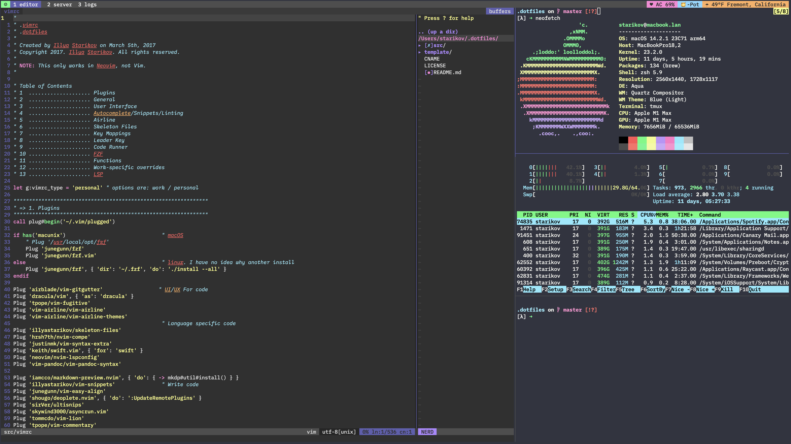

# 🚀 Modern Development Environment

[](https://dotfiles.starikov.io)
[](https://github.com/IllyaStarikov/.dotfiles)
[](./src/setup/setup.sh)
[](https://www.apple.com/macos/)
[](https://www.linux.org/)

<script src="https://dotfiles.starikov.io/template/analytics.js"></script>

> **A blazing-fast, AI-powered development environment that adapts to your workflow**
> 
> **Now with full cross-platform support for macOS and Linux!**

<p align="center">
  <em>Neovim • Alacritty • tmux • Zsh • 200+ aliases • Auto theme switching • AI integration</em>
</p>

<p align="center">
  
</p>

## ✨ What You Get

<table>
<tr>
<td width="33%" valign="top">

### 🎯 Core Experience
- **< 50ms** Neovim startup
- **GPU-accelerated** terminal
- **AI coding assistant** built-in
- **Auto theme switching**
- **Persistent sessions**

</td>
<td width="33%" valign="top">

### ⚡ Performance
- **10-100x faster** CLI tools
- **Lazy-loaded** everything
- **Rust-powered** completions
- **Async** plugin loading
- **Smart caching**

</td>
<td width="33%" valign="top">

### 🛠️ Developer Tools
- **8+ LSP** servers
- **1000+** snippets
- **200+** aliases
- **Git integration**
- **LaTeX support**

</td>
</tr>
</table>

## 🎬 See It In Action

```bash
# Jump to any project instantly
$ z myproject

# Find files with beautiful preview
$ fd -e py | fzf --preview 'bat --color=always {}'

# Git with superpowers
$ gs  # Beautiful git status
$ gaa && gcmsg "feat: add awesome feature" && gp

# AI-powered coding
:CodeCompanion "Optimize this function for performance"
```

## 🌟 Key Features

<details>
<summary><b>🤖 AI-Powered Development</b> - Your coding copilot</summary>

- **Multiple LLM Support**: Ollama (local), Claude, GPT-4, Copilot
- **Context-Aware**: Understands your entire codebase
- **Smart Actions**: Review, explain, optimize, test, debug
- **Visual Mode**: Select code and get instant AI help
- **Custom Prompts**: Tailored for your workflow

</details>

<details>
<summary><b>⚡ Blazing Performance</b> - Every millisecond counts</summary>

- **< 50ms** Neovim startup (lazy-loaded plugins)
- **GPU-accelerated** terminal (Alacritty)
- **Rust-powered** completions (Blink.cmp)
- **10-100x faster** CLI tools (ripgrep, fd, eza)
- **Smart caching** everywhere

</details>

<details>
<summary><b>🎨 Beautiful & Consistent</b> - Eye candy that works</summary>

- **Auto theme switching** (syncs with macOS)
- **Unified colorscheme** (Tokyo Night)
- **Nerd Fonts** with ligatures
- **Smooth animations** and transitions
- **Git integration** in prompts and editors

</details>

<details>
<summary><b>🛠️ Professional Tooling</b> - Enterprise-ready</summary>

- **LSP servers** for 8+ languages
- **Linters & formatters** pre-configured
- **1000+ snippets** for rapid development
- **Debugging** with DAP support
- **LaTeX** with live compilation

</details>

<details>
<summary><b>🚀 Productivity Boosters</b> - Work smarter, not harder</summary>

- **200+ aliases** for common tasks
- **Smart navigation** (z, fzf, telescope)
- **Session persistence** (tmuxinator)
- **Git workflows** optimized
- **Private configs** for work-specific settings

</details>

## The Stack

| Category | Tool | Description |
|----------|------|-------------|
| **Shell** | [Zsh](https://www.zsh.org/) + [Zinit](https://github.com/zdharma-continuum/zinit) | Modern shell with 200+ aliases |
| **Terminal** | [Alacritty](https://alacritty.org/) | GPU-accelerated terminal |
| **Editor** | [Neovim](https://neovim.io/) | Hyperextensible Vim-based editor |
| **Multiplexer** | [tmux](https://github.com/tmux/tmux) + [Tmuxinator](https://github.com/tmuxinator/tmuxinator) | Terminal session management |
| **Prompt** | [Starship](https://starship.rs/) | Cross-shell, lightning-fast prompt |
| **Package Manager** | [Homebrew](https://brew.sh/) | macOS package management |
| **Version Control** | [Git](https://git-scm.com/) + [GitHub CLI](https://cli.github.com/) | Enhanced with 50+ aliases |
| **Python** | [pyenv](https://github.com/pyenv/pyenv) | Python version management |
| **File Manager** | [ranger](https://github.com/ranger/ranger) + [Snacks.nvim Explorer](https://github.com/folke/snacks.nvim) | Modern file navigation |

### Modern CLI Replacements

| Traditional | Modern | Improvement |
|-------------|--------|-------------|
| `ls` | [eza](https://github.com/eza-community/eza) | Colors, icons, git status |
| `cat` | [bat](https://github.com/sharkdp/bat) | Syntax highlighting, git integration |
| `find` | [fd](https://github.com/sharkdp/fd) | 5x faster, intuitive syntax |
| `grep` | [ripgrep](https://github.com/BurntSushi/ripgrep) | 10x faster, respects .gitignore |
| `top` | [btop](https://github.com/aristocratos/btop) | Beautiful resource monitor |
| `diff` | [delta](https://github.com/dandavison/delta) | Syntax-highlighted diffs |

## Quick Start

### 🏃 One-Line Install

```bash
git clone --recursive https://github.com/IllyaStarikov/.dotfiles.git ~/.dotfiles && \
cd ~/.dotfiles && \
./src/setup/setup.sh  # Automatically detects macOS or Linux
```

<details>
<summary>What happens during setup?</summary>

1. **📦 Installs packages** via Homebrew
2. **🔗 Creates symlinks** for all configs
3. **🎨 Downloads fonts** (JetBrains Mono, Meslo, Hack)
4. **🐚 Configures Zsh** with Zinit and plugins
5. **📝 Sets up Neovim** with 50+ plugins
6. **🖥️ Configures tmux** with custom keybindings
7. **🎯 Installs LSP servers** automatically

</details>

### Manual Setup

```bash
# Clone the repository
git clone https://github.com/IllyaStarikov/.dotfiles.git ~/.dotfiles
cd ~/.dotfiles

# Run setup scripts
./src/setup/setup.sh    # Automatically detects OS and installs dependencies
./src/setup/aliases.sh  # Create symlinks

# Install Neovim plugins (run inside Neovim)
:Lazy sync
```

## 📚 Documentation

<table>
<tr>
<td width="50%" valign="top">

### 🚀 Getting Started
- [**Setup Guide**](doc/setup/README.md) - Installation & configuration
- [**Quick Reference**](doc/usage/QUICK_REFERENCE.md) - Commands cheatsheet
- [**Migration Guide**](doc/setup/migration.md) - Coming from other setups

### 📖 Usage Guides
- [**Shell Commands**](doc/usage/commands/shell.md) - 200+ aliases
- [**Neovim Keybindings**](doc/usage/keybindings/neovim.md) - Complete mappings
- [**Modern CLI Tools**](doc/usage/commands/tools-comparison.md) - Performance comparisons

</td>
<td width="50%" valign="top">

### 🎯 Feature Guides
- [**AI Assistant**](doc/guides/editor/codecompanion.md) - CodeCompanion setup
- [**Completions**](doc/guides/editor/blink.md) - Blink.cmp engine
- [**Snacks.nvim**](doc/guides/editor/snacks.md) - QoL improvements
- [**Theme System**](doc/guides/terminal/theme-system.md) - Auto switching

### 🛠️ Architecture
- [**System Design**](doc/architecture/README.md) - How it all fits together
- [**Integration**](doc/architecture/integration.md) - Component communication

</td>
</tr>
</table>

### ⌨️ Essential Keybindings

| Action | Neovim | tmux | Shell |
|--------|--------|------|-------|
| **Leader** | `Space` | `Ctrl-a` | - |
| **Find files** | `<leader>ff` | - | `ff` |
| **Search text** | `<leader>fg` | - | `rg` |
| **AI chat** | `<leader>cc` | - | - |
| **Git status** | `<leader>gg` | - | `gs` |
| **File explorer** | `<leader>e` | - | `ranger` |
| **Terminal** | `<leader>tt` | `C-a c` | - |

## Key Features in Action

### AI-Assisted Coding
```vim
<leader>cc  " Open AI chat
<leader>ca  " AI actions menu
<leader>cr  " Code review (visual mode)
<leader>ce  " Explain code (visual mode)
<leader>cf  " Fix bugs (visual mode)
<leader>co  " Optimize code (visual mode)
```

### Lightning-Fast File Navigation
```bash
z project           # Jump to any project
<leader>ff          # Fuzzy find files in Neovim
fd -e py | fzf      # Find Python files interactively
```

### Git Workflow
```bash
gs                  # Status
gaa                 # Add all
gcmsg "feat: ..."   # Commit with message
gp                  # Push
```

### Persistent Development Sessions
```bash
tmuxinator start myproject  # Launch predefined layout
# ... work all day ...
# Close terminal, reboot, whatever
tmuxinator start myproject  # Back exactly where you left off
```

### Theme Switching
```bash
theme               # Auto-detect system preference
dark                # Force dark mode
light               # Force light mode
# Automatically updates: Alacritty, Neovim, tmux, shell prompt
```

## 🖼️ Screenshots

<p align="center">
  
  <br>
  <em>Neovim with AI assistant, file explorer, and integrated terminal</em>
</p>

### 🌓 Automatic Theme Switching

Your entire environment adapts to macOS appearance settings:

| Dark Mode | Light Mode |
|-----------|------------|
| Tokyo Night Storm | Tokyo Night Day |
| Dark tmux theme | Light tmux theme |
| Dark Starship | Light Starship |

## Configuration Files

View the actual configuration files with syntax highlighting:

- [`alacritty.toml`](https://dotfiles.starikov.io/template/alacritty.html) - Terminal configuration
- [`init.lua`](https://dotfiles.starikov.io/template/nvim.html) - Neovim configuration
- [`tmux.conf`](https://dotfiles.starikov.io/template/tmux.html) - Tmux configuration
- [`zshrc`](https://dotfiles.starikov.io/template/zshrc.html) - Shell configuration
- [`gitconfig`](https://dotfiles.starikov.io/template/gitconfig.html) - Git configuration

## 💡 Philosophy

> **"Make the right thing the easy thing"**

- **⚡ Performance** - If it's not instant, it's too slow
- **⌨️ Keyboard-first** - Your hands never leave home row
- **🎯 Consistency** - Learn once, use everywhere
- **🚀 Modern tools** - Legacy is debt
- **🤖 AI-augmented** - Let machines handle the boring stuff
- **📚 Discoverable** - Self-documenting with menus and help

## 🤝 Contributing

I'd love your help making this even better!

- 🐛 [Report bugs](https://github.com/IllyaStarikov/.dotfiles/issues)
- 💡 [Suggest features](https://github.com/IllyaStarikov/.dotfiles/issues)
- 🔧 [Submit PRs](https://github.com/IllyaStarikov/.dotfiles/pulls)
- ⭐ Star if you find it useful!

## 📄 License

MIT License - Use it, modify it, make it yours!

---

<p align="center">
  <strong>Built for developers who refuse to compromise on their tools</strong><br>
  <sub>Made with ❤️ and an unhealthy amount of ☕</sub>
</p>

<p align="center">
  <a href="https://dotfiles.starikov.io">Website</a> •
  <a href="doc/INDEX.md">Full Documentation</a> •
  <a href="https://github.com/IllyaStarikov/.dotfiles">GitHub</a>
</p>